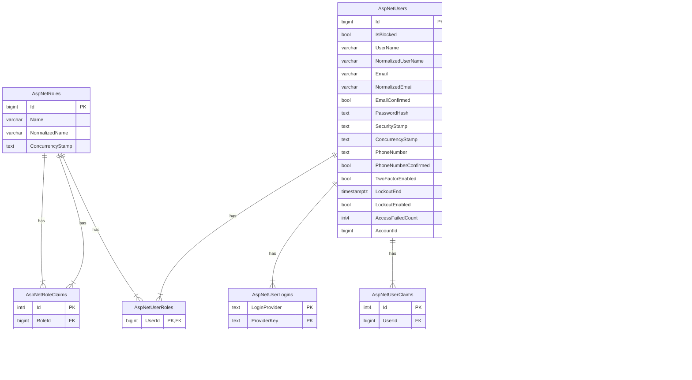

# auth-api

## Run in Visual Studio

First run this script to run a db and mocked external deps:

```bash
docker compose --profile MockForDevelopment up --build
```

## Karate Tests

### Run Karate Tests Against Api Running in IDE (not Docker Compose)

Run Db and MockServer executing the following command (don't close the terminal unless you want to stop the containers)

```bash
docker compose --profile MockForDevelopment up --build
```

Then execute following command inside of the dev-container

```bash
API_ROOT_URL=http://host.docker.internal:5503 java -jar /karate.jar .
```

### Run Karate against Api, Db, and MockServer in Docker Compose

Run Api, Db, and MockServer executing the following command (don't close the terminal unless you want to stop the containers)

```bash
docker compose --profile MockForTests up --build
```

Then execute following command inside of the dev-container

```bash
java -jar /karate.jar .
```

### Running Karate Tests, Api, Db, and MockServer in Docker Compose

Run the docker compose with MockForPullRequest profile executing the following command (don't close the terminal unless you want to stop the containers)

```bash
docker compose --profile MockForPullRequest up --build
```

>Note: this also includes Karate Tests run by default. However, if you want to run the test again from Dev Container execute:

```bash
java -jar /karate.jar .
```

## Database scheme 

This project is based on the [TourmalineCore.AspNetCore.JwtAuthentication](https://github.com/TourmalineCore/TourmalineCore.AspNetCore.JwtAuthentication/tree/master/JwtAuthentication.Identity) library which contains [Microsoft Identity Platform](https://learn.microsoft.com/en-us/entra/identity-platform/), so the database schema is inherited from them.


